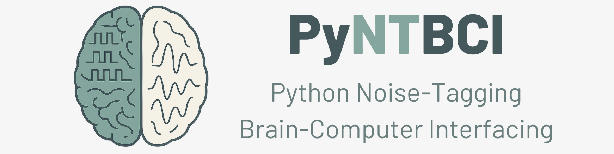

PyntBCI
=======

The Python Noise-Tagging Brain-Computer interfacing (PyNTBCI) library is a Python toolbox for the noise-tagging brain-computer interfacing (BCI) project developed at the Donders Institute for Brain, Cognition and Behaviour, Radboud University, Nijmegen, the Netherlands. PyntBCI contains various signal processing steps and machine learning algorithms for BCIs that make use of evoked responses of the electroencephalogram (EEG), specifically code-modulated responses such as the code-modulated visual evoked potential (c-VEP).

For a constructive review of this field, see [mar2021]_.

When using PyntBCI, please reference at least one of the following articles: [thi2015]_, [thi2021]_, [thi2025]_.

Installation
------------

To install PyntBCI, use:

	pip install pyntbci

Getting started
---------------

Various tutorials and example analysis pipelines are provided in the `tutorials/` (under Getting Started) and `examples/` (under Examples) folder. Most operate on synthetic EEG data generated on the fly (see `pyntbci.eeg`); one example instead uses real EEG data obtained through MOABB.

References
----------

.. [thi2025] Thielen, J. (2025). Addressing BCI inefficiency in c-VEP-based BCIs: A comprehensive study of neurophysiological predictors, binary stimulus sequences, and user comfort. BPEX. doi: `10.1088/2057-1976/ade316 <https://doi.org/10.1088/2057-1976/ade316>`_
.. [thi2021] Thielen, J., Marsman, P., Farquhar, J., & Desain, P. (2021). From full calibration to zero training for a code-modulated visual evoked potentials for brain–computer interface. JNE. doi: `10.1088/1741-2552/abecef <https://doi.org/10.1088/1741-2552/abecef>`_
.. [mar2021] Martínez-Cagigal, V., Thielen, J., Santamaría-Vázquez, E., Pérez-Velasco, S., Desain, P., & Hornero, R. (2021). Brain–computer interfaces based on code-modulated visual evoked potentials (c-VEP): a literature review. Journal of Neural Engineering. DOI: `10.1088/1741-2552/ac38cf <https://doi.org/10.1088/1741-2552/ac38cf>`_
.. [thi2015] Thielen, J., van den Broek, P., Farquhar, J., & Desain, P. (2015). Broad-Band visually evoked potentials: re(con)volution in brain-computer interfacing. PLOS ONE. doi: `10.1371/journal.pone.0133797 <https://doi.org/10.1371/journal.pone.0133797>`_

Datasets
--------

On the Radboud Data Repository (`RDR <https://data.ru.nl/>`_):

.. [thi2021rdr] Thielen et al. (2021) From full calibration to zero training for a code-modulated visual evoked potentials brain computer interface. DOI: `10.34973/9txv-z787 <https://doi.org/10.34973/9txv-z787>`_
.. [ahm2019rdr] Ahmadi et al. (2019) Sensor tying. DOI: `10.34973/ehq6-b836 <https://doi.org/10.34973/ehq6-b836>`_
.. [thi2018rdr] Thielen et al. (2018) Broad-Band Visually Evoked Potentials: Re(con)volution in Brain-Computer Interfacing. DOI: `10.34973/1ecz-1232 <https://doi.org/10.34973/1ecz-1232>`_
.. [ahm2018rdr] Ahmadi et al. (2018) High density EEG measurement. DOI: `10.34973/psaf-mq72 <https://doi.org/10.34973/psaf-mq72>`_

On Mother of all BCI Benchmarks (`MOABB <https://moabb.neurotechx.com/docs/index.html>`_):

.. [thi2015moabb] c-VEP dataset from Thielen et al. (2015). `Link <https://moabb.neurotechx.com/docs/generated/moabb.datasets.Thielen2015.html#moabb.datasets.Thielen2015>`_
.. [thi2021moabb] c-VEP dataset from Thielen et al. (2021). `Link <https://moabb.neurotechx.com/docs/generated/moabb.datasets.Thielen2021.html#moabb.datasets.Thielen2021>`_

Contact
-------

* Jordy Thielen (jordy.thielen@donders.ru.nl)

.. toctree::
   :glob:
   :hidden:
   :maxdepth: 10
   :caption: Contents
   :titlesonly:

   Getting Started <tutorials/index>
   Examples <examples/index>
   API <api>
